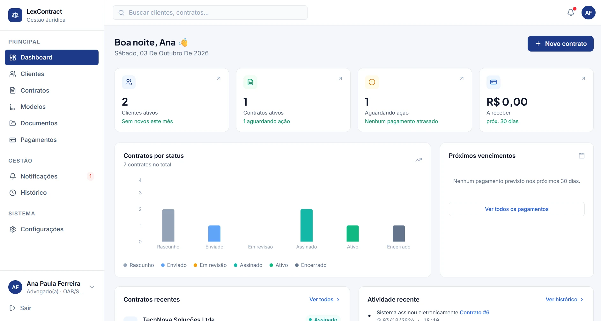
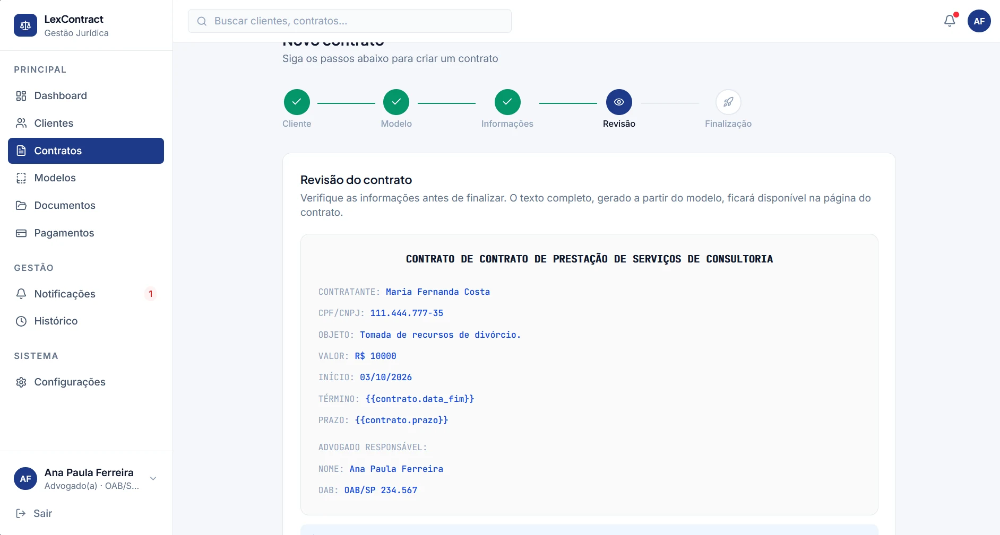
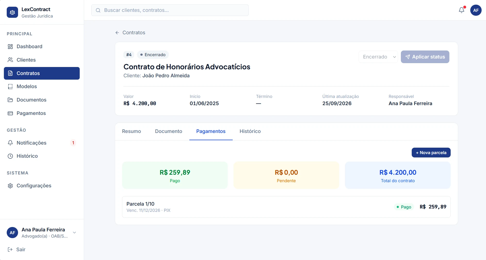
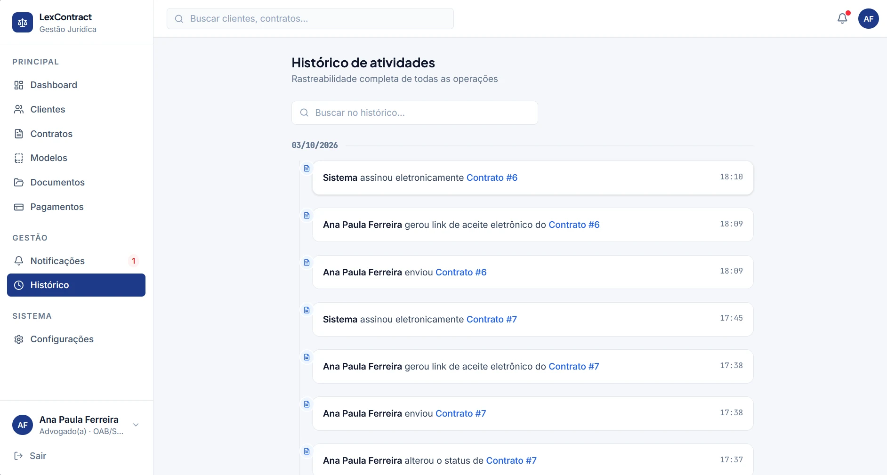

# LexContract

SaaS de gestão de contratos de prestação de serviços jurídicos para advogados autônomos e pequenos escritórios de advocacia.


**Demo:** <https://law-contract-management.pages.dev>



## Visão geral

Escritórios de advocacia de pequeno porte costumam gerenciar clientes, contratos, modelos, documentos e cobranças em planilhas soltas, e-mail e papel — um processo lento, sujeito a erro humano e sem rastreabilidade. O **LexContract** centraliza esse fluxo em um único sistema: cada escritório (tenant) cadastra seus clientes, gera contratos a partir de modelos reutilizáveis, acompanha o ciclo de vida do contrato (rascunho → envio → assinatura → vigência → encerramento), anexa documentos, controla parcelas de pagamento e mantém um histórico de auditoria de tudo o que aconteceu.

O público-alvo são advogados autônomos e pequenos escritórios que precisam de organização e profissionalismo na gestão contratual sem a complexidade (ou o custo) de um ERP jurídico completo.

## Telas

| Novo contrato — revisão | Detalhe do contrato |
| --- | --- |
|  |  |
| **Pagamentos do contrato** | **Contratos com filtros** |
|  |  |

**Histórico de atividades (auditoria)**



## Principais funcionalidades

Todos os itens abaixo existem no código atual (rotas, services e páginas correspondentes):

- **Autenticação** via e-mail/senha (JWT), com sessão validada em `GET /auth/me`.
- **RBAC por papel** (`ADMIN`, `LAWYER`, `ASSISTANT`), reforçado no backend.
- **Gestão de usuários** do escritório (exclusiva de `ADMIN`): criação, papel e status.
- **Dashboard** com métricas operacionais, gráfico de contratos por status e indicadores financeiros.
- **Clientes** (pessoa física ou jurídica): cadastro, edição, busca e inativação/remoção.
- **Modelos de contrato**, com variáveis (`{{grupo.campo}}`) substituídas automaticamente na geração do texto.
- **Contratos**: criação a partir de um modelo (wizard em etapas), edição em rascunho com versionamento automático do conteúdo, e transições de status controladas (`RASCUNHO → ... → ATIVO/ENCERRADO/CANCELADO`).
- **Término e renovação**: `endDate` opcional no contrato, indicador de vencimento próximo e alerta automático (30 dias) via `Notification`, disparado por um cron diário no GitHub Actions.
- **Busca global** no topo do sistema (clientes, contratos, modelos, documentos e usuários) e **filtros avançados** em contratos (período de início/término, faixa de valor, cliente, status).
- **Aceite eletrônico** por link público de uso único (assinatura eletrônica simples, **não** ICP-Brasil), com token com hash, expiração, IP/data registrados pelo backend e vínculo com a versão exata do contrato.
- **Documentos**: upload, categorização e download de arquivos vinculados a um contrato.
- **Pagamentos**: parcelas por contrato, registro de recebimento e indicadores (pago, pendente, atrasado, a receber nos próximos 30 dias).
- **Notificações** por usuário, geradas automaticamente em eventos-chave do contrato (enviado, assinado, ativo).
- **Web Push** (notificações do navegador, gratuito, via VAPID): aviso imediato de contrato próximo do vencimento e de contrato assinado pelo cliente, ativado pelo usuário em Configurações. Veja [`backend/README.md`](backend/README.md#web-push-notificações-do-navegador).
- **Histórico/auditoria**: toda ação relevante (criação, edição, remoção, mudança de status, pagamento) é registrada e listada.
- **Configurações/gestão do escritório**: dados do escritório editáveis (exclusivo de `ADMIN`) e perfil do usuário autenticado.

## Stack

**Frontend**
- React 19 + TypeScript
- Vite 8
- React Router 7
- Tailwind CSS 4
- Lucide React (ícones)
- Recharts (gráficos do dashboard)

**Backend**
- Node.js 20+ / TypeScript
- Fastify 5
- PostgreSQL 16 + Prisma ORM 6
- Zod (validação de env vars e de requisições)
- `web-push` (Web Push com VAPID)
- JWT (`@fastify/jwt`) + bcryptjs
- Vitest (testes unitários e de integração)

**Infra**
- Docker (frontend e backend) + Docker Compose (backend + PostgreSQL)
- GitHub Actions (CI + deploy encadeado) → Render (API) e Cloudflare Pages (frontend)
- Playwright (testes E2E, Chromium) · Sentry opcional (captura de erros)

## Como rodar

### Desenvolvimento local

**Backend** (requer PostgreSQL; o jeito mais rápido é o Docker Compose da seção seguinte):

```bash
cd backend
cp .env.example .env     # defina DATABASE_URL, JWT_SECRET etc.
npm install              # também roda `prisma generate` (postinstall)
npm run db:migrate       # cria/aplica migrations
npm run db:seed          # popula dados de desenvolvimento (3 usuários, um por papel)
npm run dev              # API com hot-reload em http://localhost:3333
```

**Frontend** (em outro terminal, na raiz do repositório):

```bash
npm install
npm run dev
```

Usuários de desenvolvimento criados pelo seed (senha `Senha@123` para todos):

| Papel     | E-mail                         |
| --------- | ------------------------------ |
| ADMIN     | `muryllo@escritorio.com.br`    |
| LAWYER    | `advogado@escritorio.com.br`   |
| ASSISTANT | `assistente@escritorio.com.br` |

### Docker

**Backend + PostgreSQL** (Docker Compose):

```bash
cd backend
cp .env.example .env   # defina um JWT_SECRET forte
docker compose up
```

Sobe o container `postgres` (com healthcheck) e o `backend`, que aguarda o banco ficar saudável, aplica as migrations (`prisma migrate deploy`) e inicia a API em `http://localhost:3333`. Veja [`backend/README.md`](backend/README.md) para variáveis de ambiente, seed e troubleshooting.

**Frontend** (build multi-stage: Node para o build do Vite, Nginx para servir os estáticos):

```bash
docker build -t lexcontract-frontend .
# opcional: apontar para uma API diferente de http://localhost:3333 (valor embutido em build-time)
docker build --build-arg VITE_API_URL=https://api.seudominio.com -t lexcontract-frontend .

docker run -p 8080:80 lexcontract-frontend
# acesse http://localhost:8080
```

O Nginx faz fallback de SPA (`nginx.conf`): qualquer rota do React Router (`/dashboard`, `/clientes`, `/contratos`, etc.) acessada diretamente retorna `index.html` em vez de 404.

## Arquitetura

```text
Frontend (React + Vite)
        ↓  HTTP/JSON
API Fastify (Routes → Controllers)
        ↓
Services (regra de negócio)
        ↓
Prisma Client
        ↓
PostgreSQL
```

O backend segue uma arquitetura de **modular monolith**: cada domínio (`clients`, `contracts`, `contract-templates`, `documents`, `payments`, `notifications`, `audit`, `dashboard`, `offices`, `users`, `auth`) vive em `backend/src/modules/<módulo>/`, com seus próprios `*.routes.ts`, `*.controller.ts`, `*.service.ts` e `*.schemas.ts` — sem acoplamento direto entre módulos além do necessário (ex.: `contracts` referenciando `clients`/`contract-templates` por id). Código transversal (autenticação, tratamento de erros, paginação, serialização) fica em `backend/src/shared/`.

O sistema é **multi-tenant por escritório**: todo recurso de negócio guarda um `officeId`, e cada service filtra explicitamente por ele — dois escritórios nunca enxergam os dados um do outro.

### Estrutura do projeto

```text
law-contract-management/
├── .github/workflows/ci.yml     # pipeline de CI + deploy
├── docs/                         # documentação operacional e screenshots
├── e2e/                          # testes E2E (Playwright)
├── playwright.config.ts
├── Dockerfile                    # imagem de produção do frontend (Node build → Nginx)
├── nginx.conf                    # fallback de SPA para o React Router
├── public/sw.js                  # Service Worker do Web Push
├── src/                          # frontend (React + Vite)
│   ├── components/               # ProtectedRoute, StatusBadge...
│   ├── contexts/AuthContext.tsx  # sessão do usuário
│   ├── layouts/AppLayout.tsx     # shell com sidebar/navegação
│   ├── pages/                    # uma página por rota (Dashboard, Clientes, Contratos...)
│   ├── services/                 # chamadas de API por domínio
│   └── lib/api-client.ts         # cliente HTTP central
└── backend/                      # API Fastify
    ├── Dockerfile                # imagem de produção do backend
    ├── docker-compose.yml        # Postgres + backend
    ├── prisma/schema.prisma      # modelo de dados
    └── src/
        ├── modules/              # um módulo por domínio (routes/controller/service/schemas)
        └── shared/               # auth, erros, http, utils transversais
```

## Segurança

Mecanismos existentes e verificáveis no código:

- **JWT** assina e valida a sessão (`@fastify/jwt`); toda rota protegida usa o preHandler `authenticate`.
- **RBAC** via `requireRole(...roles)`, aplicado nas rotas que exigem um papel específico (tabela abaixo). A autorização é sempre verificada no backend — o frontend só usa o papel do usuário para ajustar a UI (ex.: `SettingsPage` só libera a edição do escritório para `ADMIN`), nunca como mecanismo de segurança. Quem forçar uma chamada direta à API recebe `403 Forbidden`.
- **bcryptjs** faz o hash de senhas; a senha nunca é armazenada ou logada em texto puro.
- **Validação com Zod** em body/params/querystring de toda rota que recebe entrada do cliente.
- **CORS** restrito à(s) origem(ns) configurada(s) em `CORS_ORIGIN`.
- **Isolamento multi-tenant por `officeId`**: toda query de leitura/escrita nos services filtra pelo escritório do usuário autenticado (`request.user.officeId`), nunca por um id vindo livremente do cliente.
- **Endpoints públicos de aceite** protegidos por token aleatório (SHA-256 no banco), expiração, uso único transacional e rate limit próprio; os jobs internos (renovação, alertas de pagamento e de link de assinatura) usam `CRON_SECRET`, não o JWT. 2FA (TOTP) opcional para ADMIN/LAWYER, com segredo criptografado em repouso. Veja `backend/README.md` → *Alertas, financeiro, aprovação interna e 2FA*.
- **Web Push**: a chave privada VAPID existe só no backend; subscriptions pertencem ao usuário autenticado, o `endpoint` só é aceito de serviços de push conhecidos (anti-SSRF) e o conteúdo do push é apenas um resumo sem dados sensíveis.
- **Redação de dados sensíveis nos logs**: o logger (Pino) tem `redact` configurado para nunca logar o header `Authorization`, cookies, senha ou hash de senha (`backend/src/app.ts`).

Este projeto **não** alega conformidade com LGPD ou qualquer certificação de segurança — os itens acima são os mecanismos efetivamente implementados, não uma auditoria de compliance.

### RBAC por papel

| Rota                                                                     | Papéis permitidos | Motivo                                                                                                    |
| ------------------------------------------------------------------------ | ----------------- | --------------------------------------------------------------------------------------------------------- |
| `PATCH /offices/me`                                                      | `ADMIN`           | Dados administrativos do escritório                                                                       |
| Gestão de usuários (`/users`, exceto o próprio perfil)                   | `ADMIN`           | Controle de acesso ao escritório                                                                          |
| `POST/PATCH/DELETE /contract-templates`                                  | `ADMIN`, `LAWYER` | Definir o texto legal de um modelo é um ato jurídico                                                      |
| `POST /contracts`, `PATCH /contracts/:id`, `PATCH /contracts/:id/status` | `ADMIN`, `LAWYER` | Criar/editar um contrato e movê-lo entre status (enviar, assinar, ativar) é o núcleo do trabalho jurídico |

Leitura (`GET`) desses recursos, e todos os demais módulos (clientes, documentos, pagamentos, notificações, dashboard, auditoria), permanecem acessíveis a qualquer usuário autenticado — são operações auxiliares/operacionais que já faziam parte do fluxo normal de um `ASSISTANT`.

## Qualidade, CI/CD e operação

- **Testes**: Vitest (unitários + integração via `app.inject()`) no backend e **4 fluxos E2E com Playwright** (login, criar contrato, enviar contrato, registrar pagamento).
- **CI** (GitHub Actions): `frontend` · `backend` · `docker` · `e2e` em todo push e PR.
- **Deploy**: só roda em `push` para `main`, **depois** de todos os gates passarem, via Deploy Hooks do Render (API) e do Cloudflare Pages (frontend).
- **Observabilidade**: Sentry opcional (sem DSN, nada é enviado), com tokens de assinatura redigidos.

Detalhes em:

- [CI/CD e deploy](docs/ci-cd.md) — jobs, Deploy Hooks, concorrência, migrations em produção, health checks
- [Testes E2E](docs/testes-e2e.md) — fluxos cobertos e como rodar localmente
- [Observabilidade](docs/observabilidade.md) — Sentry, privacidade e CSP
- [`backend/README.md`](backend/README.md) — variáveis de ambiente, seed, Web Push, cron de renovação

## Case Study

### Problema

Pequenos escritórios de advocacia frequentemente não têm um sistema dedicado para acompanhar o ciclo de vida de um contrato de prestação de serviços: da negociação inicial ao encerramento, passando por geração do texto, envio, assinatura, cobrança de honorários e guarda de documentos. Sem isso, a informação fica espalhada entre e-mail, WhatsApp, planilhas e pastas físicas — dificultando auditoria, cobrança e continuidade quando mais de uma pessoa (advogado, sócio, assistente) precisa acompanhar o mesmo caso.

### Solução

O LexContract organiza esse fluxo em torno de um único domínio central — o **Contrato** — que referencia um **Cliente** e um **Modelo**, é responsabilidade de um **usuário** (o advogado responsável) e acumula **versões** do texto, **documentos**, **pagamentos** e entradas de **auditoria**. Cada mudança de status relevante dispara uma **notificação**. Todo esse grafo é isolado por **escritório** (`officeId`), permitindo que o mesmo sistema atenda múltiplos tenants sem risco de vazamento de dados.

### Decisões técnicas

- **Modular monolith em vez de microserviços**: para o volume e a equipe de um produto neste estágio, múltiplos serviços trariam custo operacional (deploy, observabilidade, comunicação de rede) sem benefício real. Os módulos já são separados em pastas com fronteiras claras, o que barateia uma futura extração.
- **Fastify + Prisma + PostgreSQL**: Fastify por performance e por um sistema de hooks direto (`preHandler` é a base do RBAC); Prisma por type-safety entre schema e código; PostgreSQL por ser a escolha madura e relacional para dados fortemente relacionados (cliente → contrato → versões/documentos/pagamentos).
- **JWT + bcryptjs**: autenticação stateless, simples de escalar horizontalmente; bcryptjs evita dependência de compilação nativa em diferentes ambientes de build/deploy.
- **RBAC com `requireRole()` nos `preHandler`s**, em vez de tabela de permissões ou ACL: com três papéis fixos e regras estáveis por domínio, uma camada dinâmica adicionaria complexidade sem necessidade real. Autenticação e autorização são etapas separadas e sequenciais (`authenticate` → `requireRole` → `validate`), e o backend é a única fonte de verdade para permissões.
- **Docker multi-stage nas duas aplicações**: o frontend usa Node só no build e entrega estáticos via Nginx; o backend separa dependências de produção do estágio de build, sem `devDependencies` na imagem final.
- **CI com jobs independentes + deploy encadeado**: cada frente falha de forma rápida e específica, a imagem Docker só é construída depois que build/typecheck/testes passam, e o `deploy` só ocorre após todos os gates e apenas em `main`.

### Aprendizados

- Organizar o backend em módulos por domínio (e não por camada técnica) manteve cada funcionalidade fácil de localizar e evoluir isoladamente.
- Persistência relacional com Prisma tornou explícitas, via `@@index` e `@@unique`, regras que ficariam só na cabeça de quem escreveu o código (ex.: um CPF/CNPJ não pode se repetir *dentro do mesmo escritório*, mas pode entre escritórios diferentes).
- Testes de integração via `app.inject()` cobrem HTTP + autenticação + autorização + banco sem a lentidão e a instabilidade de subir um servidor real.
- Servir o frontend como estáticos por Nginx (e não por um processo Node) deixou a pegada de produção menor e mais simples de operar.
